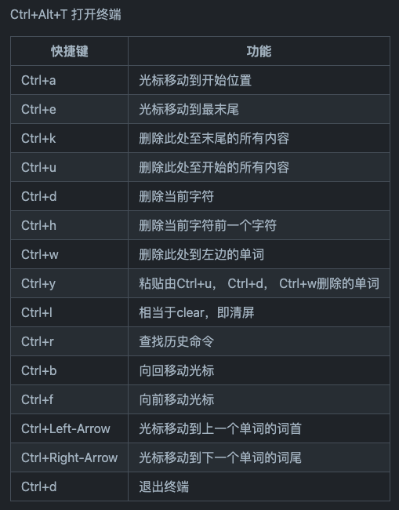
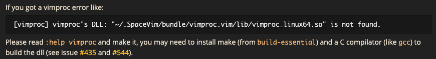

目标：

- 安装好Linux系统
- 安装好Linux系统下常用开发工具

# 1. deb/rpm包安装

基于Debian的Linux操作系统，有两种包管理工具：

1. DPT：管理deb的软件包，Debian Package

```bash
# 安装
dpkg --install <package.deb>

# 列出<package.deb>的内容中包含的文件结果
dpkg --contents <package.deb>

# 提取包裹信息的详细信息，包括软件名称、版本以及大小等
dpkg --list <package>

# 移除一个已安装的包裹（通过 dpkg -I 命令查看），remove只是删掉数据和可执行文件
dpkg -r <package.deb>

# 完全清除一个已安装的包裹，purge要删除所有的配置文件
dpkg -P <package.deb>

# 列出包裹安装的所有文件（-L等价于--listfiles）
dpkg -L <package.deb>

# 显示已经安装包裹的详细信息
dpkg --status <package>

# 重新配置一个已经安装的包裹（貌似还可以使用 debconf，debconf为包裹安装提供了一个统一的配置界面）
dpkg -reconfigure <package>
```

1. RPM：管理rpm软件包，Redhat PackageManager

```bash
# 安装, -v显示正在安装的文件信息，-h显示安装进度
rpm -i <package.rpm>

# 查询信息
# rpm -q ...(-a, -i, -l, -s)
# 还有两个附加命令用于指定需要查询的是安装包还是已安装后的文件
# -p：查询的是安装包的信息
# -f：查询的是已安装的某文件信息

# -a，查询已经安装的包
rpm -qa | grep tomcat4 

# -i，显示安装包的信息
rpm -qi <package.rpm>

# -l，显示安装包中的所有文件被安装到哪些目录下
rpm -qif /bin/df

# -s，显示安装版中的所有文件状态及被安装到哪些目录下
rpm -qlf /bin/df

# 升级包
rpm -U <package.rpm>
```


# 2. 从源码编译

```bash
# 1. 解压
tar -zxvf olala.tar.gz

# 2. 检查环境变量及配置编译选项，加--prefix可以指定软件将要安装到目标路径
./configure --prefix=软件目录名

# 3. 源码编译成二进制文件
make

# 4. 安装，将make编译出来的文件安装到指定位置（或默认位置）
make install

# 卸载
make uninstall
# 或者使用
rm -rf 软件目录名
```


# 3. apt在线安装

apt换源

- 清华源：https://mirrors.tuna.tsinghua.edu.cn/help/ubuntu/
- 中科大源：https://mirrors.ustc.edu.cn/help/

```
sudo vim /etc/apt/sources.list

# 修改成以下内容
# 默认注释了源码镜像以提高 apt update 速度，如有需要可自行取消注释
deb https://mirrors.tuna.tsinghua.edu.cn/ubuntu/ focal main restricted universe multiverse
# deb-src https://mirrors.tuna.tsinghua.edu.cn/ubuntu/ focal main restricted universe multiverse
deb https://mirrors.tuna.tsinghua.edu.cn/ubuntu/ focal-updates main restricted universe multiverse
# deb-src https://mirrors.tuna.tsinghua.edu.cn/ubuntu/ focal-updates main restricted universe multiverse
deb https://mirrors.tuna.tsinghua.edu.cn/ubuntu/ focal-backports main restricted universe multiverse
# deb-src https://mirrors.tuna.tsinghua.edu.cn/ubuntu/ focal-backports main restricted universe multiverse
deb https://mirrors.tuna.tsinghua.edu.cn/ubuntu/ focal-security main restricted universe multiverse
# deb-src https://mirrors.tuna.tsinghua.edu.cn/ubuntu/ focal-security main restricted universe multiverse

# 预发布软件源，不建议启用
# deb https://mirrors.tuna.tsinghua.edu.cn/ubuntu/ focal-proposed main restricted universe multiverse
# deb-src https://mirrors.tuna.tsinghua.edu.cn/ubuntu/ focal-proposed main restricted universe multiverse
# 更新/var/lib/apt/lists里的内容
sudo apt-get update 

# 升级所有的包
sudo apt-get upgrade

# 安装
sudo apt-get install <app>

# 卸载
sudo apt-get remove <app>

# 卸载并彻底清除
sudo apt-get remove --purge <app>

# 清理下载文件的存档
sudo apt-get clean
```


# 4. 常用terminal快捷键




# 5. 装机必备

1. zsh三件套：zsh、oh-my-zsh、starship

```bash
# 1. 安装zsh
sudo apt-get install zsh

# 2. 安装oh-my-zsh
sh -c "$(wget https://raw.github.com/robbyrussell/oh-my-zsh/master/tools/install.sh -O -)"

# 3. 安装starship：https://starship.rs/guide/
sh -c "$(curl -fsSL https://starship.rs/install.sh)"

# vim ~/.zshrc
eval "$(starship init zsh)"
```

2. tmux：终端复用器

- 阮一峰的tmux使用教程：http://www.ruanyifeng.com/blog/2019/10/tmux.html
- 路易斯的tmux使用手册：http://louiszhai.github.io/2017/09/30/tmux/

```bash
sudo apt-get install tmux
```

3. vim配置

- spacevim：https://spacevim.org/SpaceVim-release-v1.7.0/
- use vim as a c/c++ IDE：https://spacevim.org/use-vim-as-a-c-cpp-ide/
- use vim as a python IDE：https://spacevim.org/use-vim-as-a-python-ide/

```bash
curl -sLf https://spacevim.org/install.sh | bash
```



