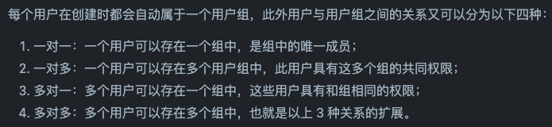
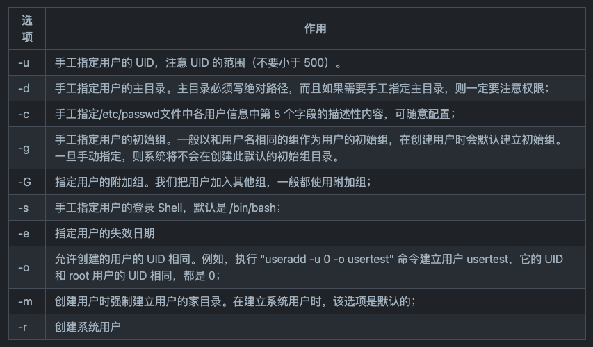
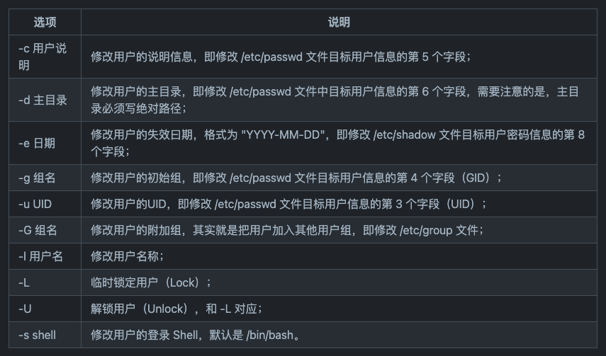
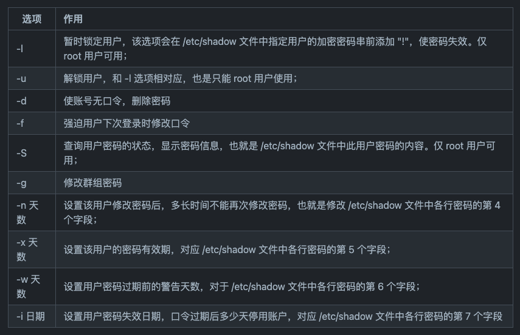
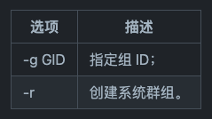
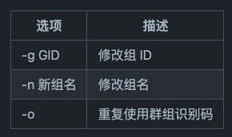

目标：

- 掌握Linux用户和组管理方法


# 1. 用户和组的基本概念

1. 什么是user和group？

   Linux是多用户多任务的操作系统，可以支持多个用户同时登陆执行不同的任务，不同的用拥有不同的权限。

   用户又分超级用户（系统管理员root）和普通用户。

   用户组，就类似于微信里的小群，这群人都拥有某一个权限，方便集中管理。

   用户组和用户一样也分为两种，一种是主用户组（primary group），一种是次用户组（secondary group）。主用户组的信息保存在`/etc/passwd`里，次用户组的信息保存在`/etc/group`中。

   当用户被创建后默认属于主用户组，后来再将该用户加入其它用户组的话，加入的用户组为该用户的此用户组。

2. 用户与用户组的关系是什么？

   


3. 用户ID和组ID有分别是什么？怎么查看？
   在Linux系统中，是通过用户ID来判断是哪个用户，用户名只是为了方便人来识别用户的，当我们创建一个名为 olala 的新用户时，会给这个新用户赋予一个名为 olala 的用户组，并且成为该新建用户组的唯一用户，同时 UID 和 GID 会被分别写入`/etc/passwd`和`/etc/group`中。

   ```bash
   sudo useradd olala
   grep olala /etc/passwd
   
   # 用户名:口令:用户标识号:组标识号:注释性描述:主目录:登录shell
   # olala:x:1001:1001::/home/olala:/bin/sh
   
   grep olala /etc/group
   # olala:x:1001:
   ```

   `root`的UID为0。

   

   1. 什么是主目录？
      => 就是用户的起始工作目录，在`/home`下的和用户名同名的文件夹。
   2. 什么是注释性描述？
      => 这个字段并没有什么实际的用途。在不同的Linux 系统中，这个字段的格式并没有统一。在许多Linux系统中，这个字段存放的是一段任意的注释性描述文字，用做finger命令的输出。


# 2. 常用的用户和用户组管理命令

## 2.1 用户的增删修改

添加用户：

```bash
useradd 选项 用户
```




删除用户：

```bash
# -r选项表示在删除用户的时候同时删除用户的home目录
userdel 选项 用户
```


修改用户：（mod=modify）

```bash
usermod 选项 用户名
```




修改用户密码：

```bash
passwd 选项 用户名
```




## 2.2 用户组的增删修改

添加用户组：

```bash
groupadd 选项 用户
```




删除用户组：
如果一个群组里面还包括某些用户，则必须先删除这些用户后，才能删除该群组。

```bash
groupdel 组名
```


修改用户组属性：

```bash
groupmod 选项 用户
```




切换用户组重新登录：

```bash
# newgrp类似于login指令，作用是以当前的账号，另一个群组，再次登入系统
newgrp 目标用户组
```


---

参考资料：

- [https://github.com/datawhalechina/team-learning-program/blob/master/Linux/3.Linux%E7%94%A8%E6%88%B7%E5%92%8C%E7%BB%84%E7%AE%A1%E7%90%86.md](https://github.com/datawhalechina/team-learning-program/blob/master/Linux/3.Linux用户和组管理.md)
