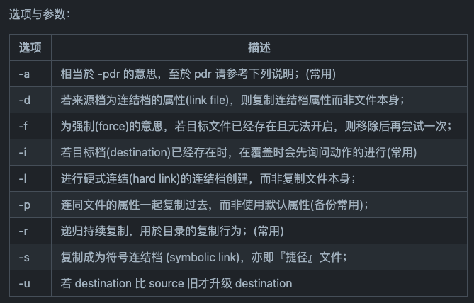

目标：
- [ ] 理解Linux文件和目录管理的原理
- [ ] 理解Linux文件和目录管理基本命令


# 常用命令
```bash
# list 当前文件夹
# -a：全部文件，连同隐藏文件一起罗列
# -d：仅罗列目录本身，而不列出目录内文件数据
# -l: 罗列出长数据串，包含文件的属性和权限等
ls

# print working directory
# -P：显示出确实的路径，而不是使用link后的路径
pwd

# make dirctory
# -p：帮你直接把所需要的目录（包含上一级目录）递归创建起来
# -m：配置文件权限
mkdir

# remove dirctory
# -p：连同上一级“空的”目录一起删除
rmdir

# link
# 软链接类似于快捷方式
ln -s test.txt test_softlink
ln test.txt test_hardlink

# copy
cp 选项 源文件 目标地址/文件
```


```bash
# remove
rm
```


```bash
# move
mv 源地址/文件 目标地址/文件
```


```bash
cat 选项 目标文件地址
```


---
参考资料：
- https://github.com/datawhalechina/team-learning-program/blob/master/Linux/4.%20Linux%E6%96%87%E4%BB%B6%E5%92%8C%E7%9B%AE%E5%BD%95%E7%AE%A1%E7%90%86.md